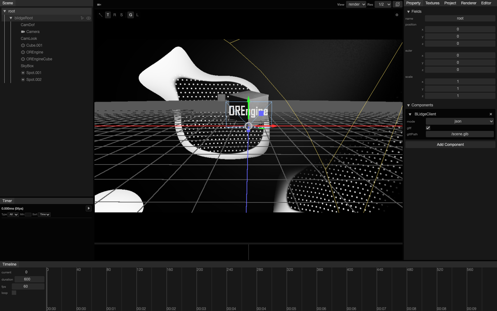

# OREngine

OREngine (オーアールエンジン) は WebGL 製の軽量 3D エンジンです。64KB Intro Demo の制作を目的としており、TypeScript で実装されています。



## 特徴

- コンポーネントベースの柔軟なアーキテクチャ
- Vite を用いた高速ビルドシステム
- React との統合や Blender 連携に対応

## インストール

### 1. 依存パッケージの取得

```bash
npm install
```

### 2. ShaderMinifier の準備

[Shader_Minifier](https://github.com/laurentlb/Shader_Minifier) を取得し、実行ファイルへのパスを通してください。

#### Windows

ShaderMinifier をインストール後、Path を設定します。

#### macOS

`shader_minifier.exe` を `/Documents/application/shader_minifier/shader_minifier.exe` に配置し、Mono をインストールします。

```bash
brew install mono
```

## 実行

```bash
npm run dev
```

## プロジェクト切替

アクティブなプロジェクトはルート直下の `orengine.config.json` の `project` フィールドで指定します。切り替えは値を書き換えて `npm run dev` を実行するだけです。

```json
{
	"project": "demo-webgl"
}
```

一時的に切り替える場合は環境変数 `ORENGINE_PROJECT` を利用できます。

```bash
ORENGINE_PROJECT=<name> npm run dev
```

## 新規プロジェクト作成

`orengine.config.json` の `project` に未存在の名前を書いて `npm run dev` するだけです。テンプレート（`host/template/project/`）から雛形が生成されます。

## ビルド

```bash
npm run build
```

## デモ公開 (GitHub Pages)

`main` または `master` へ push すると `https://<user>.github.io/<repo>/` にデプロイされます。`develop` ブランチは `https://<user>.github.io/<repo>/develop/`、プルリクエストは `https://<user>.github.io/<repo>/pr-<番号>/` にそれぞれ配置されます。ワークフローの設定は `.github/workflows/pages.yml` にあります。

デモ用のビルドでは ShaderMinifier をスキップしているため、`SKIP_SHADER_MINIFIER=true` が環境変数として渡されます。将来的に Storybook を追加した場合は `public/storybook` 以下に成果物を配置することで同じ仕組みでデプロイできます。

## テスト

```bash
npm run test:render-flow
```

## ドキュメント

補足ドキュメントは [`docs`](./docs) ディレクトリにまとめています。

## クレジット

ビルドサイズを 64KB 以下に抑えるにあたり、以下のツールに多大な助力をいただきました。
作者の皆さまに心より感謝いたします。

- [compeko](https://gist.github.com/0b5vr/09ee96ca2efbe5bf9d64dad7220e923b) by **0b5vr**
- [Shader Minifier](https://github.com/laurentlb/shader-minifier?tab=readme-ov-file) by **Ctrl-Alt-Test**

## ライセンス

このプロジェクトは [MIT License](./LICENSE) の下で公開されています。
