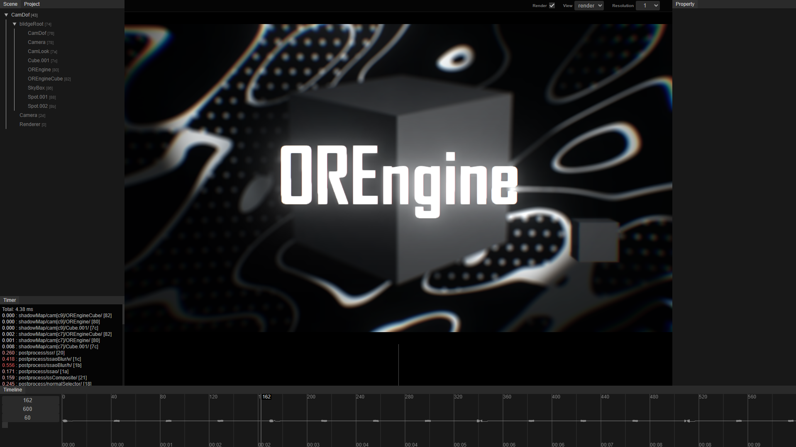

# OREngine

OREngine (オーアールエンジン) は WebGL 製の軽量 3D エンジンです。64KB Intro Demo の制作を目的としており、TypeScript で実装されています。



## 特徴

- コンポーネントベースの柔軟なアーキテクチャ
- Vite を用いた高速ビルドシステム
- React との統合や Blender 連携に対応

## インストール

### 1. サブモジュールと依存パッケージの取得

`packages/glpower` は git submodule として提供されています。このサブモジュールを含む依存パッケージ一式を取得するため、以下のコマンドを実行します。

```bash
npm run init
```

### 2. ShaderMinifier の準備

[Shader_Minifier](https://github.com/laurentlb/Shader_Minifier) を取得し、実行ファイルへのパスを通してください。

#### Windows

ShaderMinifier をインストール後、Path を設定します。

#### macOS

`shader_minifier.exe` を `/Documents/application/shader_minifier/shader_minifier.exe` に配置し、Mono をインストールします。

```bash
brew install mono
```

## 実行

```bash
npm run dev
```

## ビルド

> **重要:** ビルドやテストを行う前に一度 `npm run init` を実行してサブモジュール（`packages/glpower` など）を初期化してください。

```bash
npm run build
```

## テスト

ビルドと同様に、事前に `npm run init` を実行してサブモジュールを初期化しておく必要があります。

```bash
npm run test
```

## ドキュメント

アーキテクチャの詳細やセットアップ手順、Blender との連携方法などは [`docs`](./docs/README.md) ディレクトリにまとめています。

## クレジット

ビルドサイズを 64KB 以下に抑えるにあたり、以下のツールに多大な助力をいただきました。
作者の皆さまに心より感謝いたします。

- [compeko](https://gist.github.com/0b5vr/09ee96ca2efbe5bf9d64dad7220e923b) by **0b5vr**
- [Shader Minifier](https://github.com/laurentlb/shader-minifier?tab=readme-ov-file) by **Ctrl-Alt-Test**

## ライセンス

このプロジェクトは [MIT License](./LICENSE) の下で公開されています。
