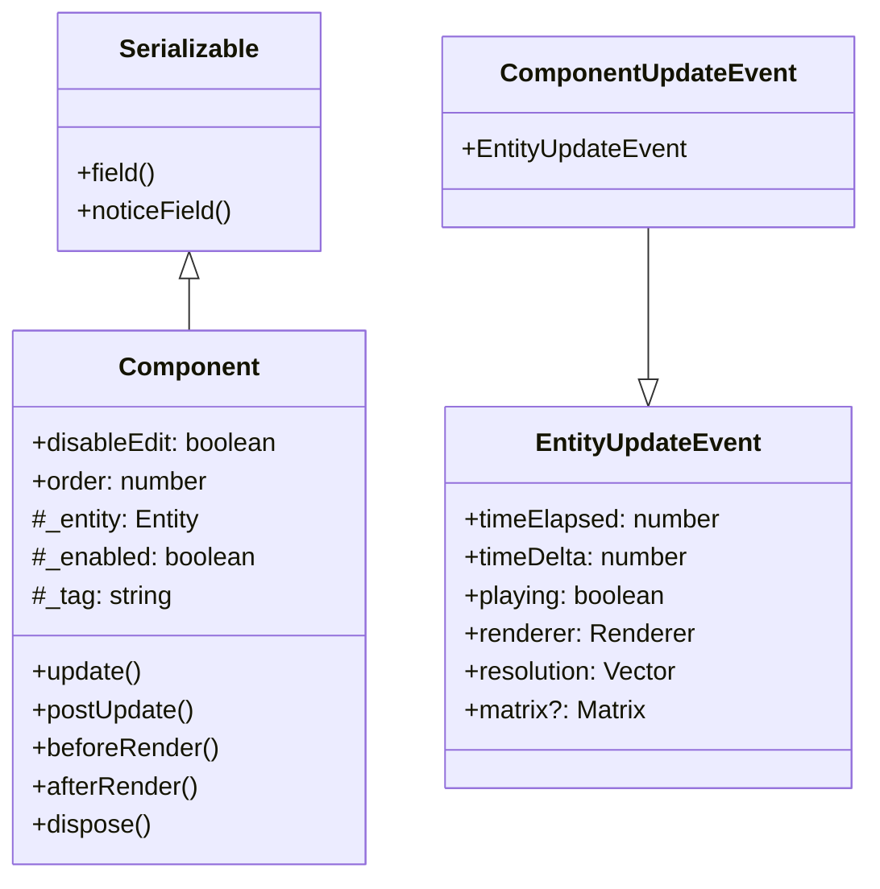
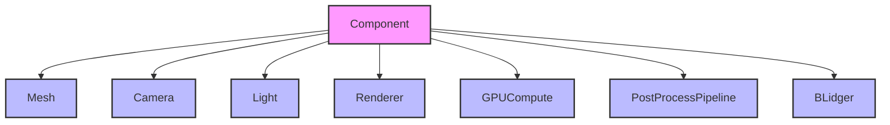
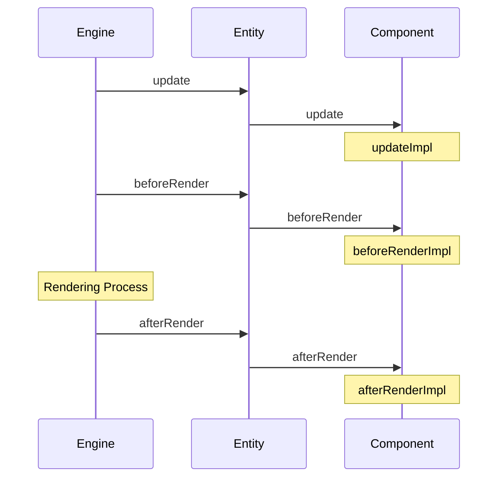

# Component System

OREngine のコンポーネントシステムは、エンティティに機能を追加するための拡張可能なアーキテクチャを提供します。各コンポーネントは特定の機能（レンダリング、物理演算、カメラ制御など）を担当し、それらを組み合わせることで複雑なオブジェクトの振る舞いを実現します。

## 設計概要

Component クラスは以下の主要な機能を提供します：

1. エンティティとの連携
2. ライフサイクル管理
3. シリアライズ/デシリアライズのサポート
4. 有効/無効の状態管理



## 標準コンポーネント

OREngine は以下の標準コンポーネントを提供します：



### 主要なコンポーネント

1. **Mesh**: 3D モデルの表示を担当
2. **Camera**: シーンのビュー管理
3. **Light**: 光源の制御
4. **Renderer**: レンダリングパイプラインの管理
5. **GPUCompute**: GPU 計算の実行
6. **PostProcessPipeline**: ポストプロセス効果の適用
7. **BLidger**: Blender との連携機能

## ライフサイクル

Component は以下のライフサイクルメソッドを持ちます：



### ライフサイクルメソッド

1. `update(event)`: 毎フレームの更新処理

   - `timeElapsed`: 経過時間
   - `timeDelta`: 前フレームからの経過時間
   - `playing`: 再生状態
   - `renderer`: レンダラーの参照
   - `resolution`: 解像度
   - `matrix`: 変換行列（オプション）

2. `beforeRender(event)`: レンダリング前の処理

   - レンダリングの準備
   - シェーダーパラメータの更新など

3. `afterRender(event)`: レンダリング後の処理
   - 後処理
   - 状態の更新など

## コンポーネントの実装

新しいコンポーネントの実装例：

```typescript
class CustomComponent extends Component {
  constructor(params: ComponentParams<CustomArgs>) {
    super(params);

    // コンポーネントの初期化
    this._tag = 'custom';
    this.order = 0;

    // シリアライズ可能なフィールドの定義
    this.field(
      'customValue',
      () => this.customValue,
      (value) => (this.customValue = value)
    );
  }

  protected updateImpl(event: ComponentUpdateEvent) {
    // フレーム更新処理
  }

  protected beforeRenderImpl(event: ComponentUpdateEvent) {
    // レンダリング前の処理
  }

  protected afterRenderImpl(event: ComponentUpdateEvent) {
    // レンダリング後の処理
  }
}
```

## エンティティとの連携

コンポーネントはエンティティに追加して使用します：

```typescript
const entity = new Entity();

// コンポーネントの追加
const component = entity.addComponent(CustomComponent, {
  // コンポーネント固有の引数
  customArg: 'value',
});

// コンポーネントの有効/無効の切り替え
component.enabled = false;

// コンポーネントの取得
const found = entity.getComponent(CustomComponent);

// タグによるコンポーネントの取得
const tagged = entity.getComponentByTag('custom');
```

## シリアライズ

Component は Serializable を継承しており、設定の保存と読み込みをサポートします：

```typescript
// フィールドの定義例
this.field(
  'enabled',
  () => this.enabled,
  (value) => (this.enabled = value),
  {
    hidden: true,
    noExport: true,
  }
);

this.field(
  'tag',
  () => this.tag,
  (value) => (this._tag = value),
  {
    readOnly: true,
    noExport: true,
    hidden: (item) => item == '',
  }
);
```

## イベントシステム

コンポーネントはイベントの発行と購読をサポートしています：

```typescript
// イベントの発行
component.emit('customEvent', { data: 'value' });

// イベントの購読
component.on('dispose', () => {
  // クリーンアップ処理
});
```

## パフォーマンスの考慮事項

1. **実行順序**: `order` プロパティを使用してコンポーネントの更新順序を制御
2. **有効/無効の制御**: `enabled` プロパティを使用して不要な処理をスキップ
3. **リソース管理**: `dispose()` メソッドで適切なリソースの解放を実装
