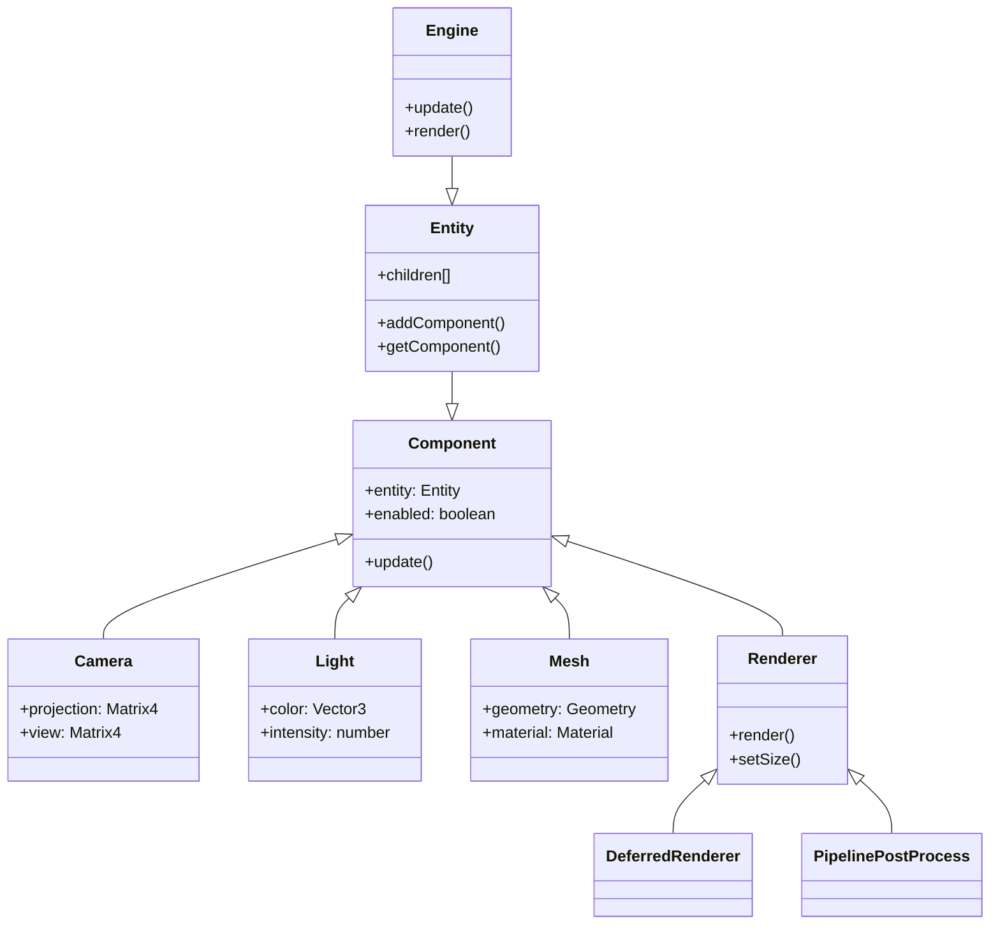
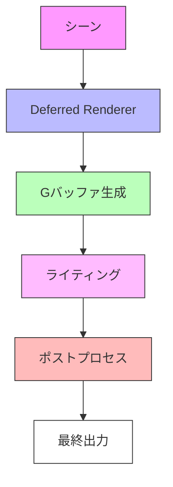

# OREngine コアアーキテクチャ

OREngine は、エンティティコンポーネントシステムをベースにした 3D グラフィックスエンジンです。

## システム構成図

## システム概要

### Engine

エンジン全体を管理する中心的なクラスです。シーングラフの更新やレンダリングのライフサイクルを制御します。

### Entity

階層構造を持つシーングラフの基本単位です。複数の Component を保持することができ、3D 空間での位置や回転などの変換を管理します。

### Component

Entity にアタッチされるモジュールのベースクラスです。具体的な機能（レンダリング、カメラ、ライトなど）を実装します。

主要なコンポーネント：

- Camera: シーンのビュー行列とプロジェクション行列を管理
- Light: シーンの照明を制御
- Mesh: 3D モデルの表示を担当
- Renderer: シーンのレンダリングを実行

### レンダリングパイプライン

1. Deferred Renderer がシーンの情報を G バッファに書き込み
2. G バッファの情報を基にライティング計算を実行
3. ポストプロセスパイプラインで画像効果を適用
4. 最終的な画像を出力
