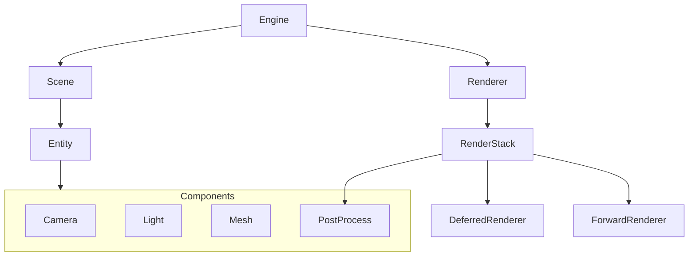
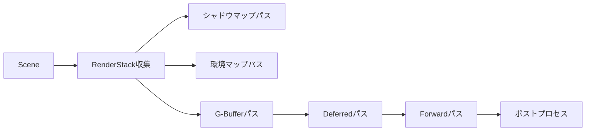

# OREngine コアアーキテクチャ

## システム構成

OREngine のコアは以下のような階層構造で設計されています：



## コア機能の関係性

### Entity システム

- すべてのゲームオブジェクトの基本となる
- 階層構造（親子関係）をサポート
- Transform 情報（位置、回転、スケール）を管理
- 複数のコンポーネントをアタッチ可能

### レンダリングパイプライン



1. **RenderStack の収集**

   - カメラ
   - ライト
   - シャドウマップ用メッシュ
   - デファードレンダリング用メッシュ
   - フォワードレンダリング用メッシュ
   - UI 要素

2. **レンダリングパス**
   - シャドウマップの生成
   - 環境マップの生成
   - G-Buffer への描画
   - ディファードライティング
   - フォワードレンダリング
   - ポストプロセス効果の適用

### コンポーネントの役割

1. **Camera**

   - ビュー行列とプロジェクション行列の管理
   - レンダリングターゲットの設定
   - ビューポートの制御

2. **Light**

   - ディレクショナルライト
   - スポットライト
   - シャドウマッピング

3. **Mesh**

   - ジオメトリデータの管理
   - マテリアルの適用
   - レンダリング設定

4. **PostProcess**
   - イメージエフェクトの適用
   - マルチパスレンダリング
   - カスタムシェーダーの適用

## データフロー

### レンダリングプロセス

1. シーンのトラバース

   ```typescript
   Scene
     ↓
   Entity (traverse)
     ↓
   RenderStack収集
     ↓
   各種レンダリングパス
   ```

2. マテリアルとシェーダー
   ```typescript
   Material
     ↓
   ShaderProgram生成
     ↓
   Uniformデータ設定
     ↓
   描画コマンド実行
   ```

### コンポーネント間の通信

- イベントシステムによる疎結合な通信
- 直接参照による効率的なアクセス
- Entity を介したコンポーネント間のデータ共有

## パフォーマンス最適化

1. **レンダリングの最適化**

   - GPU インスタンシング
   - フラスタムカリング
   - シェーダーの動的コンパイル

2. **メモリ管理**
   - VAO とバッファのキャッシング
   - テクスチャユニットの効率的な管理
   - GPU ステートの最適化

## 拡張性

- プラグインシステム
- カスタムコンポーネント
- シェーダーの拡張
- ポストプロセスの追加
