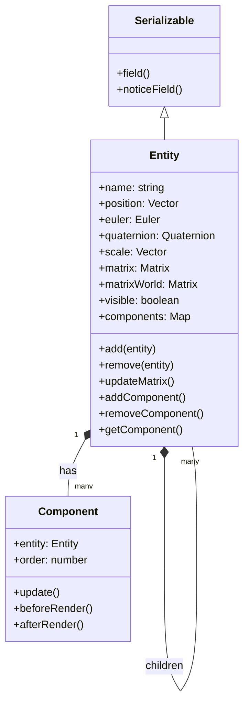
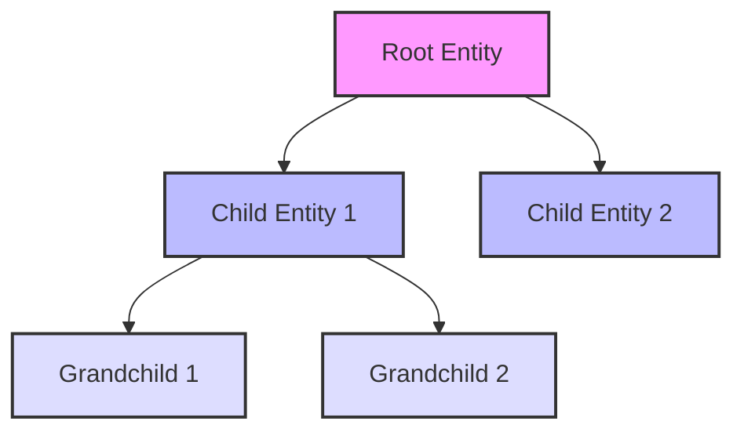
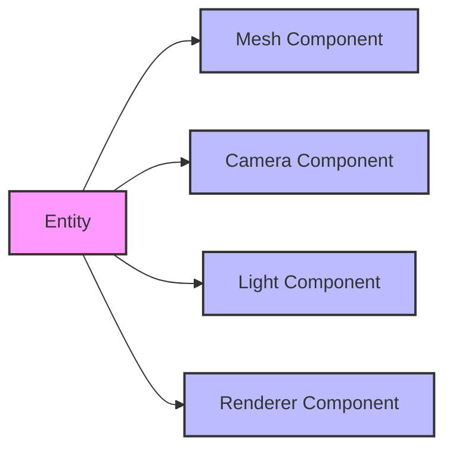
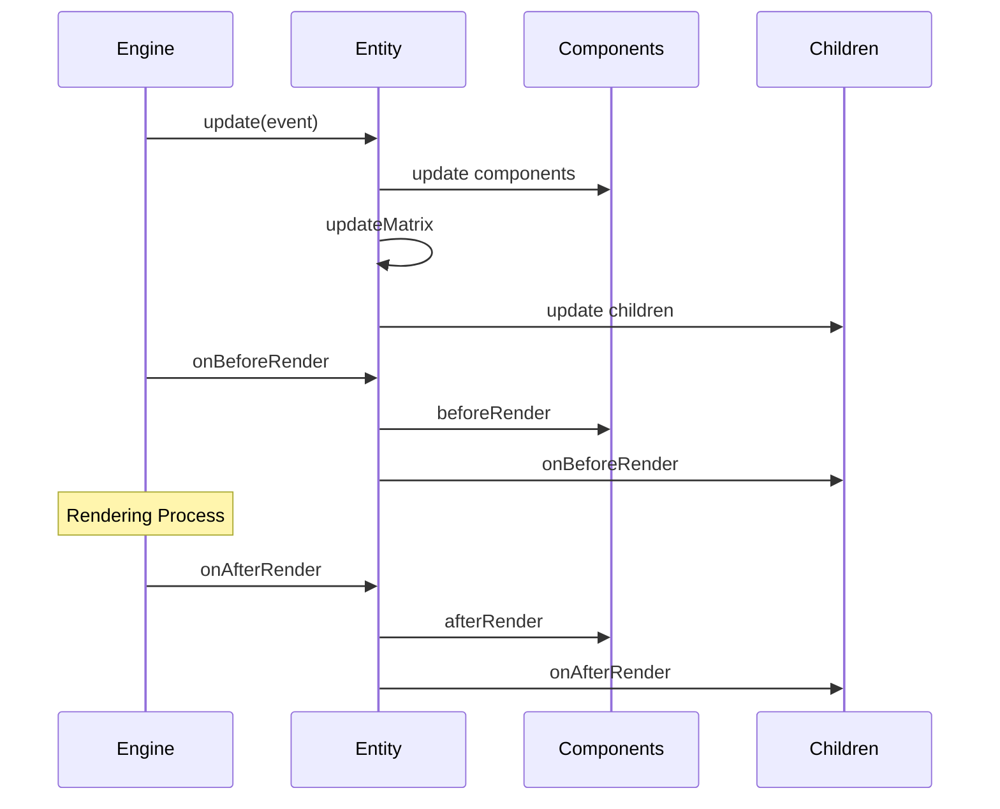

# Entity System

OREngine の Entity（エンティティ）システムは、シーン内のオブジェクトを表現する基本的な構造を提供します。
各エンティティは、位置、回転、スケールなどの変換情報を持ち、それらを組み合わせて階層構造（シーングラフ）を形成することができます。

## 設計概要

Entity クラスは以下の主要な機能を提供します：

1. 階層構造（Scene Graph）の管理
2. 3D 変換（Transform）の制御
3. コンポーネントベースのアーキテクチャ
4. シリアライズ/デシリアライズのサポート



## シーングラフ構造

エンティティは階層構造を形成することができ、親子関係を通じて変換（Transform）が伝播します。



## コンポーネントシステム

エンティティは複数のコンポーネントを持つことができ、それぞれのコンポーネントが特定の機能を提供します。



## 主要な機能

### 変換（Transform）の管理

```typescript
// 位置の設定
entity.position.set(x, y, z);

// 回転の設定（オイラー角）
entity.euler.set(x, y, z);

// スケールの設定
entity.scale.set(x, y, z);

// 行列の更新
entity.updateMatrix();
```

### コンポーネントの管理

```typescript
// コンポーネントの追加
entity.addComponent(ComponentClass, {
  // コンポーネント固有のパラメータ
});

// コンポーネントの取得
const component = entity.getComponent(ComponentClass);

// コンポーネントの削除
entity.removeComponent(ComponentClass);
```

### 階層構造の管理

```typescript
// 子エンティティの追加
parent.add(child);

// 子エンティティの削除
parent.remove(child);

// エンティティの検索
const found = entity.findEntityByName('targetName');
```

## ライフサイクル

Entity は以下のライフサイクルメソッドを持ちます：

1. `update(event)`: 毎フレーム呼び出され、エンティティとそのコンポーネントの更新を行います
2. `onBeforeRender(event)`: レンダリング前の処理を行います
3. `onAfterRender(event)`: レンダリング後の処理を行います



## イベントシステム

エンティティは階層的なイベントシステムをサポートしています：

- `noticeEventChilds`: イベントを子エンティティに伝播
- `noticeEventParent`: イベントを親エンティティに伝播
- `traverse`: すべての子孫エンティティに対して処理を実行

## シリアライズ

Entity は Serializable クラスを継承しており、シーンの保存と読み込みをサポートしています：

```typescript
// フィールドの定義
this.field(
  'name',
  () => this.name,
  (value) => (this.name = value)
);
this.field(
  'position',
  () => this.position.getElm('vec3'),
  (value) => this.position.setFromArray(value),
  { format: { type: 'vector' } }
);
```

## 使用例

```typescript
// 新しいエンティティの作成
const entity = new Entity({
  name: 'myEntity',
});

// 位置と回転の設定
entity.position.set(0, 1, 0);
entity.euler.set(0, Math.PI / 2, 0);

// コンポーネントの追加
entity.addComponent(MeshComponent, {
  geometry: new BoxGeometry(),
  material: new StandardMaterial(),
});

// 階層構造の構築
const parent = new Entity();
parent.add(entity);
```
