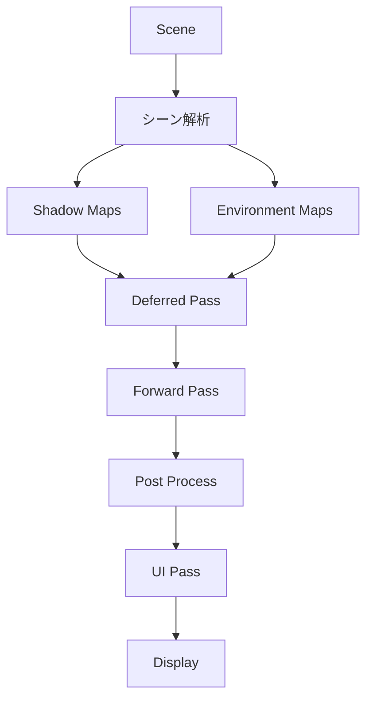
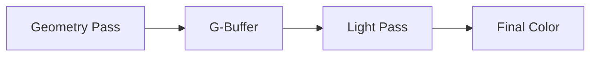

# OREngine レンダリングパイプライン

## 関連ソースコード

レンダリングパイプラインの主要なコンポーネントは以下のディレクトリに配置されています：

```
packages/maxpower/Component/Renderer/           # メインレンダラー
├── DeferredRenderer/                          # Deferredレンダリング実装
├── PMREMRender/                              # 環境マップレンダリング
├── PipelinePostProcess/                      # ポストプロセス処理
└── ProgramManager/                           # シェーダープログラム管理

packages/maxpower/Component/Camera/            # カメラ関連
└── RenderCamera/                             # レンダリングカメラ実装

packages/maxpower/Component/Light/             # ライティング実装
packages/maxpower/Component/MaterialOverride/  # マテリアルオーバーライド
packages/maxpower/Component/PostProcessPipeline/ # ポストプロセスパイプライン
```

OREngine のレンダリングパイプラインは、Deferred Shading と Forward レンダリングを組み合わせた効率的なレンダリングシステムを採用しています。このドキュメントでは、レンダリングパイプラインの詳細な仕組みと流れについて説明します。

## レンダリングパイプラインの概要



## レンダリングの主要なステップ

### 1. シーン解析と RenderStack 生成

`getRenderStack`メソッドによって、シーン内のエンティティが以下のカテゴリに分類されます：

- `light`: ライトエンティティ
- `camera`: カメラエンティティ
- `deferred`: Deferred レンダリング対象
- `forward`: Forward レンダリング対象
- `ui`: UI エレメント
- `shadowMap`: シャドウマップ生成対象
- `envMap`: 環境マップ生成対象

### 2. シャドウマップの生成

各シャドウキャスティングライトに対して、シャドウマップを生成します：

- Directional ライト
- Spot ライト
  それぞれのライトタイプに応じた適切なビュープロジェクション行列を使用

### 3. 環境マップの生成

PMREM レンダリングを使用して高品質な環境マッピングを実現：

- 6 面のキューブマップをレンダリング
- PMREM フィルタリングによる物理ベースの反射生成

### 4. Deferred レンダリング

DeferredRenderer によって、G-Buffer に以下の情報を書き込みます：

- アルベド（基本色）
- 法線
- ラフネス/メタリック
- エミッシブ
- その他のマテリアル情報



### 5. Forward レンダリング

透明オブジェクトや UI 要素など、Deferred レンダリングに適さないものを描画：

- Deferred パスの結果をテクスチャとして利用可能
- ブレンディングモードをサポート
  - NORMAL: 通常のアルファブレンド
  - ADD: 加算合成
  - DIFF: 差分合成

### 6. ポストプロセス

PipelinePostProcess クラスによる画像効果の適用：

- カメラごとのポストプロセス設定が可能
- 複数のパスを順次適用
- 柔軟なカスタマイズが可能

## 特殊なレンダリング機能

### マテリアルオーバーライド

MaterialOverride コンポーネントを使用することで、特定のパス用に異なるマテリアルを指定できます：

- シャドウマップ用の特殊マテリアル
- デバッグ表示用マテリアル
- エフェクト用マテリアル

### パフォーマンス最適化

実装: `packages/maxpower/Component/Renderer/index.ts`

- GPU クエリによるパフォーマンス計測（`this._extDisJointTimerQuery`）
- VAO（Vertex Array Object）のキャッシング（`geometry.vaoCache`）
- テクスチャユニットの効率的な管理（`TextureUnitCounter`）

### ユニフォーム管理

実装: `packages/maxpower/Component/Renderer/index.ts` の `setUniforms` メソッド

効率的なユニフォーム管理システム：

```typescript
interface DrawParam {
  viewMatrix?: Matrix4;
  projectionMatrix?: Matrix4;
  modelMatrixWorld?: Matrix4;
  uniformOverride?: Uniforms;
  // その他のパラメータ
}
```

## レンダリングパイプラインのカスタマイズ

レンダリングパイプラインは以下の方法でカスタマイズ可能です：

### コンポーネントとパス

各機能は独立したコンポーネントとして実装されています：

- カスタムポストプロセス: `packages/maxpower/Component/PostProcessPipeline/`
- マテリアルオーバーライド: `packages/maxpower/Component/MaterialOverride/`
- Deferred レンダリング: `packages/maxpower/Component/Renderer/DeferredRenderer/`
- ポストプロセス: `packages/maxpower/Component/Renderer/PipelinePostProcess/`

1. カスタムポストプロセスの追加
2. 新しいレンダリングパスの実装
3. マテリアルオーバーライドの使用
4. シェーダーの拡張とカスタマイズ

## デバッグとプロファイリング

開発モードでは以下の機能が利用可能：

- GPU タイマークエリによるパフォーマンス計測
- レンダリングパスごとの実行時間計測
- エラーチェックと警告表示

これらの機能により、レンダリングパイプラインの問題を特定し、最適化することが可能です。
