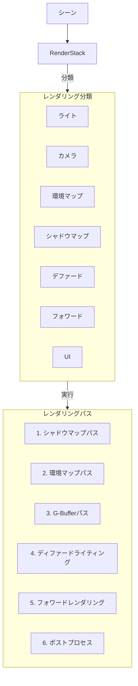

# レンダリングパイプライン

## 概要

OREngine のレンダリングパイプラインは、高品質なグラフィックスと柔軟性を提供するために、複数のレンダリングパスを組み合わせて設計されています。

## レンダリングスタック



## レンダリング順序

### 1. シャドウマップパス

- シャドウマップ用のデプスバッファを生成
- 各ライトごとにシーンを描画
- シャドウマッピングの品質を設定可能

### 2. 環境マップパス

- キューブマップの生成
- PMREM（物理ベースレンダリング用）の計算
- 反射や環境光に使用

### 3. G-Buffer パス

生成される情報：

- 位置（Position）
- 法線（Normal）
- アルベド（Albedo）
- メタリック/ラフネス（Metallic/Roughness）
- エミッシブ（Emissive）

### 4. ディファードライティング

- G-Buffer の情報を使用
- PBR ライティングの計算
- 複数光源の効率的な処理

### 5. フォワードレンダリング

- 透明オブジェクトの描画
- カスタムシェーダーの適用
- 特殊なマテリアル効果

### 6. ポストプロセス

適用可能なエフェクト：

- ブルーム
- トーンマッピング
- カラーグレーディング
- アンチエイリアシング
- 被写界深度

## マテリアルシステム

### シェーダーの種類

```typescript
MaterialRenderType =
  | 'deferred'    // G-Buffer生成用
  | 'forward'     // 通常の描画
  | 'shadowMap'   // シャドウマップ用
  | 'envMap'      // 環境マップ用
```

### マテリアル設定

- カリング設定
- デプステスト
- ブレンドモード
- シェーダー定義
- ユニフォーム変数

## レンダリングターゲット

### 主要なバッファ

1. シャドウマップバッファ

   - デプス情報
   - 解像度設定可能

2. 環境マップバッファ

   - キューブマップテクスチャ
   - PMREM 生成用バッファ

3. G-Buffer

   - マルチレンダーターゲット
   - 複数のテクスチャ

4. フォワードバッファ
   - カラーバッファ
   - デプスバッファ

## パフォーマンス最適化

### GPU 状態管理

- ステートキャッシング
- テクスチャユニット管理
- VAO の効率的な使用

### バッチング戦略

- インスタンシング対応
- マテリアルごとのソート
- ドローコールの最適化

### メモリ管理

- テクスチャのキャッシング
- シェーダープログラムの再利用
- バッファの効率的な管理
