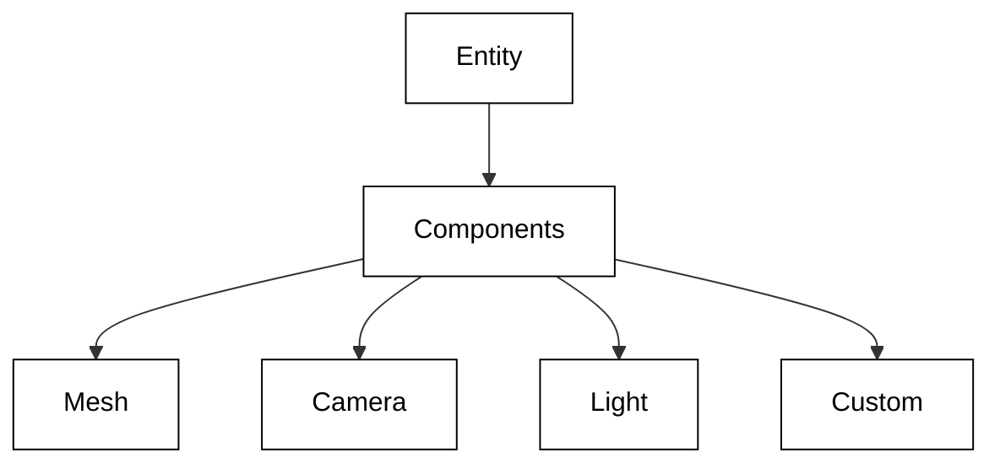
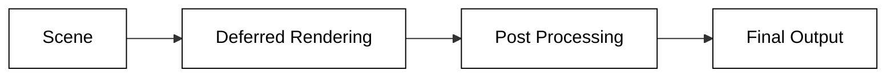

# OREngine ドキュメント

このディレクトリには、エンジンの利用方法やアーキテクチャを人間向けにまとめています。

## 概要

OREngine は WebGL を利用した 3D エンジンで、コンポーネントベースのアーキテクチャを採用しています。TypeScript で書かれており、React との統合も可能です。

## ドキュメント構造
各サブディレクトリには README を用意しており、まずは `architecture/README.md` や `core/README.md` を参照すると全体像がつかめます。

### アーキテクチャ
- [README](./architecture/README.md)
- [概要](./architecture/overview.md)
  - システム全体の説明
  - 主要機能の紹介
  - アーキテクチャの設計思想

- [プロジェクト構造](./architecture/project-structure.md)

  - ディレクトリ構成
  - パッケージの説明
  - ビルドシステム

- [コアアーキテクチャ](./architecture/core.md)
  - システムの基盤
  - データフロー
  - ライフサイクル管理

### コア機能
- [README](./core/README.md)

- [エンティティシステム](./core/entity.md)

  - エンティティの基本構造
  - シーングラフ管理
  - Transform システム

- [コンポーネントシステム](./core/components.md)

  - コンポーネントの設計
  - 標準コンポーネント
  - カスタムコンポーネント作成

- [レンダリングパイプライン](./core/render-pipeline.md)
  - レンダリングの流れ
  - シェーダーシステム
  - ポストプロセス

### インテグレーション

- [Blender 連携](./integration/blender.md)
  - BLidge システム
  - アセットパイプライン
  - データ変換

### ガイド

- [セットアップガイド](./guides/setup.md)
  - インストール手順
  - 開発環境の構築
  - デバッグ設定

## プロジェクトの特徴

### 1. コンポーネントベースのアーキテクチャ

- 柔軟なコンポーネント設計
- 拡張性の高いシステム
- カスタムコンポーネントのサポート

### 2. モダンな開発環境

- TypeScript による型安全性
- Vite による高速な開発体験
- React との統合サポート

### 3. 高度なレンダリング機能

- Deferred レンダリング
- PBR マテリアル
- カスタムシェーダー

### 4. 強力なツール連携

- Blender インテグレーション
- アセットマネジメント
- シーンエディター

## 貢献について

1. バグ報告

   - Issue テンプレートの使用
   - 再現手順の提供
   - 環境情報の記載

2. 機能リクエスト

   - 目的と背景の説明
   - ユースケースの提示
   - 期待される動作

3. プルリクエスト
   - コーディング規約の遵守
   - テストの追加
   - ドキュメントの更新

## ライセンス

MIT License
