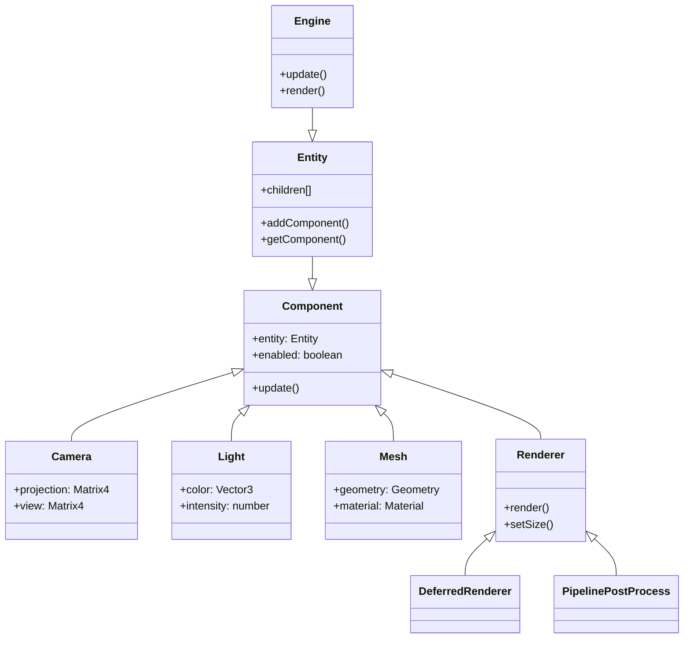
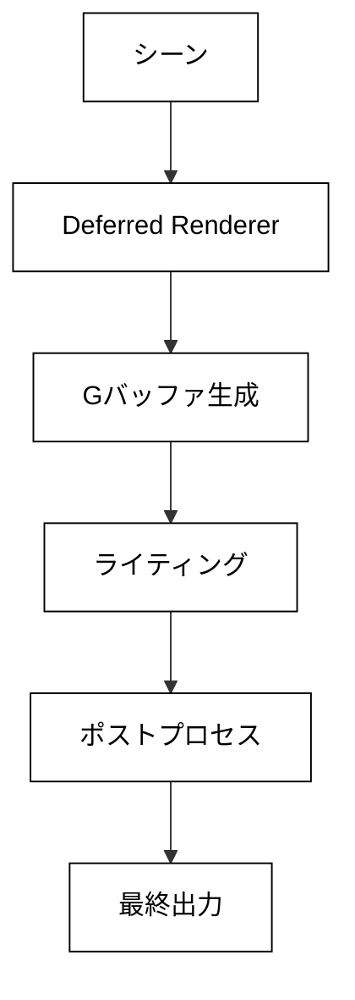

# コアアーキテクチャ

## 概要

OREngine は、エンティティコンポーネントシステムをベースにした 3D グラフィックスエンジンです。
モジュラーな設計と拡張可能なアーキテクチャにより、柔軟な 3D アプリケーションの開発を可能にします。

## システム構成図



## コアシステム

### Engine

エンジン全体を管理する中心的なクラスです：

- シーングラフの管理と更新
- レンダリングパイプラインの制御
- イベントシステムの管理
- リソース管理

#### 主要な責務

1. **シーン管理**

   - エンティティの追加/削除
   - シーングラフの更新
   - コンポーネントのライフサイクル管理

2. **レンダリング制御**

   - レンダリングパイプラインの実行
   - カメラ設定の管理
   - シャドウマップの生成

3. **リソース管理**
   - テクスチャの読み込みと管理
   - シェーダーの管理
   - ジオメトリデータの管理

### Entity

階層構造を持つシーングラフの基本単位です：

- 3D 空間での位置/回転/スケールの管理
- コンポーネントの保持と管理
- 親子関係の制御

#### 主要機能

1. **変換管理**

   ```typescript
   class Entity {
     position: Vector3;
     rotation: Quaternion;
     scale: Vector3;
     matrix: Matrix4;

     updateMatrix() {
       // ローカル変換行列の更新
     }

     updateMatrixWorld() {
       // ワールド変換行列の更新
     }
   }
   ```

2. **コンポーネント管理**
   ```typescript
   class Entity {
     addComponent<T extends Component>(componentClass: new () => T): T;
     getComponent<T extends Component>(componentClass: new () => T): T | null;
     removeComponent<T extends Component>(componentClass: new () => T): void;
   }
   ```

### Component

エンティティに機能を追加するモジュールです：

- 特定の機能（レンダリング、物理、カメラなど）を実装
- エンティティとの連携
- ライフサイクル管理

#### ライフサイクルメソッド

```typescript
class Component {
  // 初期化時に呼び出される
  initialize(): void;

  // 毎フレーム更新時に呼び出される
  update(dt: number): void;

  // レンダリング前に呼び出される
  beforeRender(): void;

  // レンダリング後に呼び出される
  afterRender(): void;

  // コンポーネント破棄時に呼び出される
  dispose(): void;
}
```

## レンダリングパイプライン



### レンダリングステージ

1. **G-Buffer 生成**

   - 位置情報
   - 法線情報
   - マテリアル情報

2. **ライティング計算**

   - PBR ベースのライティング
   - シャドウマッピング
   - 環境光の計算

3. **ポストプロセス**
   - トーンマッピング
   - ブルーム効果
   - アンチエイリアシング

## イベントシステム

コンポーネント間の通信とシステム全体のイベント管理を提供します：

```typescript
interface EventEmitter {
  on(event: string, callback: Function): void;
  off(event: string, callback: Function): void;
  emit(event: string, ...args: any[]): void;
}
```

### 主要なイベント

1. **エンティティイベント**

   - componentAdded
   - componentRemoved
   - childAdded
   - childRemoved

2. **システムイベント**
   - update
   - beforeRender
   - afterRender
   - resize

## パフォーマンス最適化

1. **フラスタムカリング**

   - ビューフラスタムによる表示判定
   - オクルージョンカリング

2. **バッチ処理**

   - インスタンシング
   - ドローコールの最適化

3. **キャッシング**
   - ジオメトリキャッシュ
   - テクスチャキャッシュ
   - シェーダーキャッシュ
