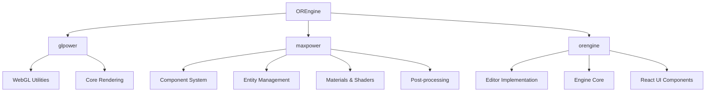

# OREngine アーキテクチャ概要

## システム構成

OREngine は 3 つの主要なパッケージで構成されています：



## パッケージ構成

### 1. glpower

基礎的な WebGL ユーティリティと描画機能を提供します：

- WebGL 基本操作
- シェーダー管理
- バッファ制御
- テクスチャ管理

### 2. maxpower

glpower の上に構築された高レベルな機能を提供します：

- コンポーネントシステム
- エンティティ管理
- ジオメトリプリミティブ
- マテリアルとシェーダー
- ポストプロセス効果
- アセットローダー（GLTF 等）

### 3. orengine

エンジン全体を統合するメインパッケージです：

- エディタの実装
- エンジンコア機能
- React UI コンポーネント

## 主要コンポーネント

### 1. レンダリングシステム

- ディファードレンダリング
- ポストプロセスパイプライン
- PBR マテリアル
- シャドウマッピング

### 2. コンポーネントシステム

- エンティティ・コンポーネントアーキテクチャ
- 標準コンポーネント（Camera, Light, Mesh 等）
- カスタムコンポーネントサポート

### 3. リソース管理

- アセットのロードとキャッシング
- シェーダー管理
- テクスチャハンドリング

### 4. ツールと機能

- Blender 連携（BLidge）
- GPU コンピュート機能
- ジオメトリプリミティブ

## プロジェクト構造

```
OREngine/
├── packages/
│   ├── glpower/      # WebGL基本機能
│   ├── maxpower/     # コンポーネントシステム
│   └── orengine/     # メインエンジン
├── plugins/          # エンジンプラグイン
├── src/             # デモ実装
└── tests/           # テストスイート
```

## アーキテクチャの特徴

1. **モジュラー設計**

   - 各パッケージが明確な責務を持つ
   - 疎結合な構造による保守性の向上
   - プラグインによる拡張性

2. **コンポーネントベース**

   - 再利用可能なコンポーネント
   - 柔軟な機能の組み合わせ
   - シリアライズ可能な構造

3. **最新技術の活用**
   - TypeScript による型安全性
   - WebGL 2.0 の活用
   - React との統合
