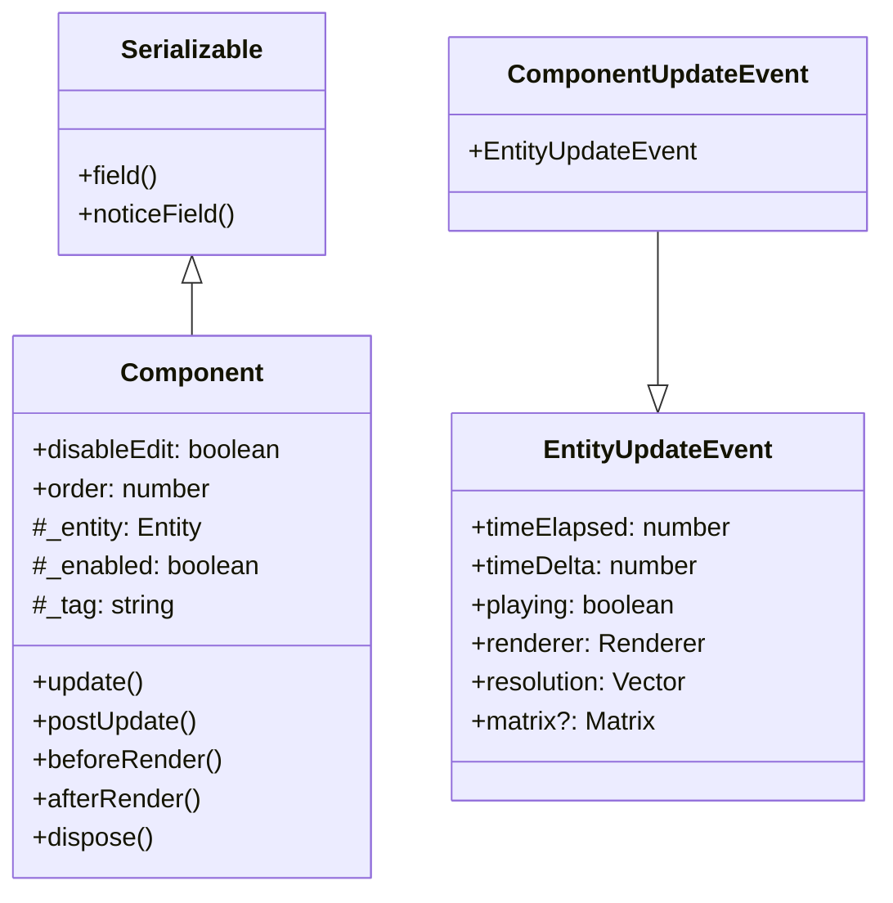
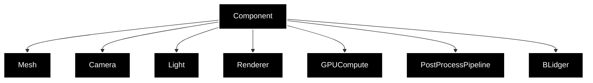
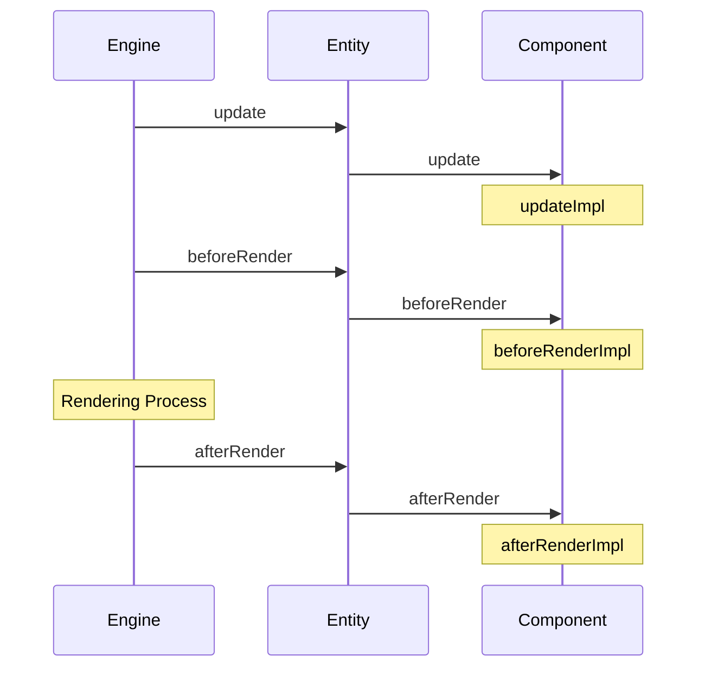

# コンポーネントシステム

## 概要

OREngine のコンポーネントシステムは、エンティティに機能を追加するための拡張可能なアーキテクチャを提供します。
各コンポーネントは特定の機能（レンダリング、物理演算、カメラ制御など）を担当し、それらを組み合わせることで複雑なオブジェクトの振る舞いを実現します。

## 設計概要



## 標準コンポーネント



### 主要なコンポーネント

1. **Mesh**: 3D モデルの表示

   - ジオメトリの管理
   - マテリアルの適用
   - レンダリング設定

2. **Camera**: シーンのビュー管理

   - プロジェクション設定
   - ビュー行列の計算
   - カメラパラメータ

3. **Light**: 光源の制御

   - 光源タイプ（Point, Directional, Spot）
   - 色と強度
   - シャドウマッピング

4. **Renderer**: レンダリングパイプライン

   - シーンのレンダリング
   - バッファ管理
   - レンダリング設定

5. **GPUCompute**: GPU 演算処理

   - コンピュートシェーダー
   - データバッファ
   - 演算パイプライン

6. **PostProcessPipeline**: ポストプロセス効果

   - エフェクトチェーン
   - シェーダーエフェクト
   - パラメータ制御

7. **BLidger**: Blender との連携
   - モデルインポート
   - アニメーション同期
   - マテリアル変換

## ライフサイクル



### ライフサイクルメソッド

```typescript
class Component {
  constructor(params: ComponentParams<T>) {
    super(params);
    this._tag = 'custom';
    this.order = 0;
  }

  protected updateImpl(event: ComponentUpdateEvent): void {
    // フレーム更新処理
  }

  protected beforeRenderImpl(event: ComponentUpdateEvent): void {
    // レンダリング前の処理
  }

  protected afterRenderImpl(event: ComponentUpdateEvent): void {
    // レンダリング後の処理
  }
}
```

## コンポーネントの実装

### 基本実装

```typescript
class CustomComponent extends Component {
  constructor(params: ComponentParams<CustomArgs>) {
    super(params);

    // コンポーネントの初期化
    this._tag = 'custom';
    this.order = 0;

    // シリアライズ可能なフィールドの定義
    this.field(
      'customValue',
      () => this.customValue,
      (value) => (this.customValue = value)
    );
  }

  protected updateImpl(event: ComponentUpdateEvent): void {
    // フレーム更新処理
  }

  protected beforeRenderImpl(event: ComponentUpdateEvent): void {
    // レンダリング前の処理
  }

  protected afterRenderImpl(event: ComponentUpdateEvent): void {
    // レンダリング後の処理
  }
}
```

### エンティティとの連携

```typescript
// コンポーネントの追加
const component = entity.addComponent(CustomComponent, {
  customArg: 'value',
});

// コンポーネントの有効/無効
component.enabled = false;

// コンポーネントの取得
const found = entity.getComponent(CustomComponent);

// タグによる取得
const tagged = entity.getComponentByTag('custom');
```

## シリアライズ

コンポーネントは Serializable を継承し、設定の保存と読み込みをサポートします：

```typescript
class CustomComponent extends Component {
  constructor() {
    super();

    // フィールドの定義
    this.field(
      'enabled',
      () => this.enabled,
      (value) => (this.enabled = value),
      {
        hidden: true,
        noExport: true,
      }
    );

    this.field(
      'tag',
      () => this.tag,
      (value) => (this._tag = value),
      {
        readOnly: true,
        noExport: true,
        hidden: (item) => item == '',
      }
    );
  }
}
```

## イベントシステム

コンポーネントはイベントの発行と購読をサポートしています：

```typescript
// イベントの発行
component.emit('customEvent', { data: 'value' });

// イベントの購読
component.on('dispose', () => {
  // クリーンアップ処理
});
```

## パフォーマンスの考慮事項

1. **実行順序の制御**

   ```typescript
   class CustomComponent extends Component {
     constructor() {
       super();
       this.order = 10; // 更新順序の設定
     }
   }
   ```

2. **有効/無効の制御**

   ```typescript
   // 不要な処理のスキップ
   if (!this.enabled) return;
   ```

3. **リソース管理**
   ```typescript
   class CustomComponent extends Component {
     dispose() {
       // リソースの解放
       super.dispose();
     }
   }
   ```

## デバッグとプロファイリング

1. **コンポーネントの状態表示**

   ```typescript
   console.log(component.toJSON()); // シリアライズされた状態
   ```

2. **パフォーマンスモニタリング**

   ```typescript
   const startTime = performance.now();
   // 処理
   const endTime = performance.now();
   console.log(`処理時間: ${endTime - startTime}ms`);
   ```

3. **エラーハンドリング**
   ```typescript
   try {
     // 処理
   } catch (error) {
     console.error(`コンポーネントエラー: ${error.message}`);
   }
   ```
