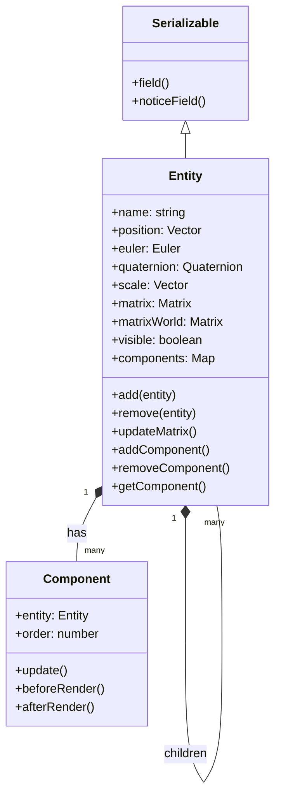
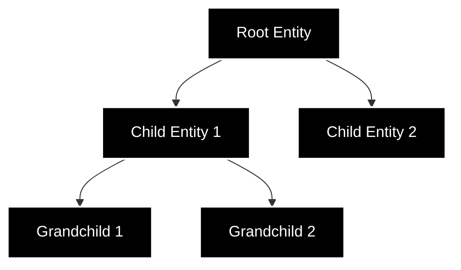

# エンティティシステム

## 概要

エンティティシステムは OREngine の基盤となる機能で、シーン内のオブジェクトを表現する基本構造を提供します。
各エンティティは、位置、回転、スケールなどの変換情報を持ち、それらを組み合わせて階層構造（シーングラフ）を形成します。

## 設計概要



## シーングラフ構造

エンティティは階層構造を形成することができ、親子関係を通じて変換（Transform）が伝播します：



## 変換（Transform）の管理

### 主要なプロパティ

```typescript
class Entity {
  // 位置
  position: Vector3;
  // 回転（オイラー角）
  euler: Euler;
  // 回転（クォータニオン）
  quaternion: Quaternion;
  // スケール
  scale: Vector3;
  // ローカル変換行列
  matrix: Matrix4;
  // ワールド変換行列
  matrixWorld: Matrix4;
}
```

### 変換の更新

```typescript
class Entity {
  // ローカル変換行列の更新
  updateMatrix() {
    this.matrix.compose(this.position, this.quaternion, this.scale);
  }

  // ワールド変換行列の更新
  updateMatrixWorld() {
    if (this.parent) {
      this.matrixWorld.multiplyMatrices(this.parent.matrixWorld, this.matrix);
    } else {
      this.matrixWorld.copy(this.matrix);
    }
  }
}
```

## コンポーネント管理

### コンポーネントの操作

```typescript
class Entity {
  // コンポーネントの追加
  addComponent<T extends Component>(
    ComponentClass: new () => T,
    params?: any
  ): T {
    const component = new ComponentClass();
    component.entity = this;
    this.components.set(ComponentClass, component);
    return component;
  }

  // コンポーネントの取得
  getComponent<T extends Component>(ComponentClass: new () => T): T | null {
    return this.components.get(ComponentClass) || null;
  }

  // コンポーネントの削除
  removeComponent<T extends Component>(ComponentClass: new () => T): void {
    const component = this.components.get(ComponentClass);
    if (component) {
      component.dispose();
      this.components.delete(ComponentClass);
    }
  }
}
```

## イベントとライフサイクル

### エンティティのライフサイクル

1. **作成時**

   ```typescript
   const entity = new Entity();
   scene.add(entity); // シーンに追加
   ```

2. **更新時**

   ```typescript
   entity.update(dt); // 毎フレーム呼び出し
   entity.updateMatrix(); // 変換の更新
   entity.updateMatrixWorld(); // ワールド変換の更新
   ```

3. **破棄時**
   ```typescript
   entity.parent.remove(entity); // シーンから削除
   entity.dispose(); // リソースの解放
   ```

### イベントシステム

エンティティは以下のイベントを発行します：

- `componentAdded`: コンポーネントが追加された時
- `componentRemoved`: コンポーネントが削除された時
- `childAdded`: 子エンティティが追加された時
- `childRemoved`: 子エンティティが削除された時

```typescript
// イベントの購読
entity.on('componentAdded', (component) => {
  console.log(`Component added: ${component.constructor.name}`);
});

// イベントの発行
entity.emit('customEvent', { data: 'value' });
```

## シリアライズ

エンティティは Serializable を継承し、シーンの保存と読み込みをサポートします：

```typescript
// フィールドの定義
this.field(
  'name',
  () => this.name,
  (value) => (this.name = value)
);

this.field(
  'position',
  () => this.position.getElm('vec3'),
  (value) => this.position.setFromArray(value),
  { format: { type: 'vector' } }
);
```

## 使用例

### エンティティの作成と設定

```typescript
// 新しいエンティティの作成
const entity = new Entity({
  name: 'myEntity',
});

// 位置と回転の設定
entity.position.set(0, 1, 0);
entity.euler.set(0, Math.PI / 2, 0);

// コンポーネントの追加
entity.addComponent(MeshComponent, {
  geometry: new BoxGeometry(),
  material: new StandardMaterial(),
});

// 階層構造の構築
const parent = new Entity();
parent.add(entity);
```

### 階層構造の操作

```typescript
// 子エンティティの追加
parent.add(child);

// 子エンティティの削除
parent.remove(child);

// エンティティの検索
const found = entity.findEntityByName('targetName');

// 全子孫の走査
entity.traverse((descendant) => {
  console.log(descendant.name);
});
```
