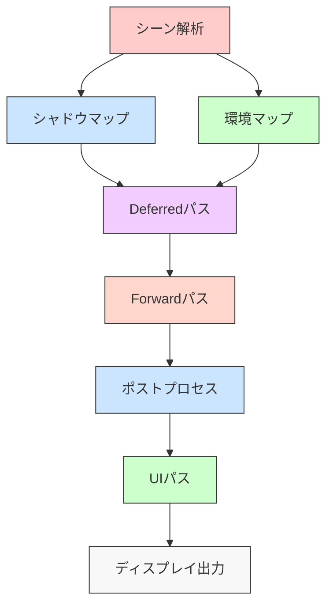
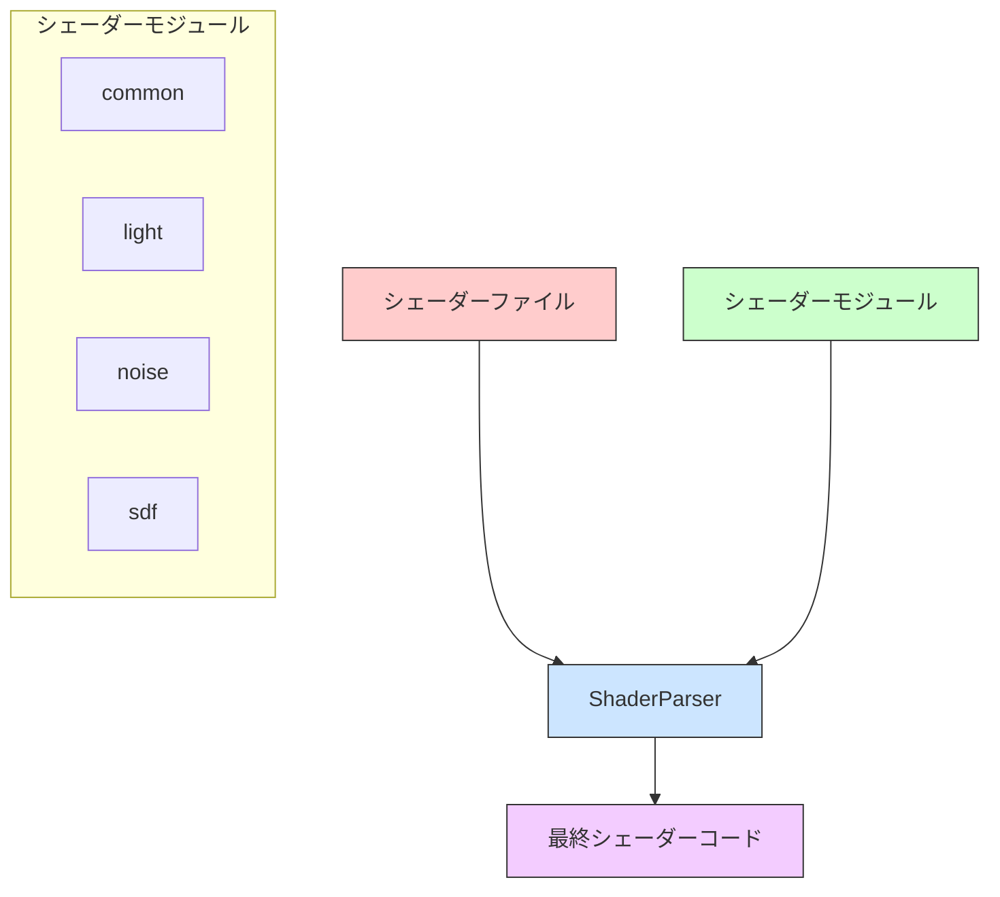
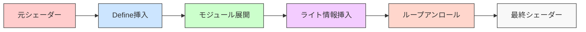

# レンダリングパイプライン

## 概要

OREngine のレンダリングパイプラインは、Deferred Shading と Forward レンダリングを組み合わせた効率的なレンダリングシステムを提供します。
このパイプラインにより、高品質なグラフィックスと柔軟なエフェクト処理を実現しています。

## パイプラインの構成



## レンダリングステージ詳細

### 1. シーン解析と RenderStack 生成

`getRenderStack`メソッドによってシーン内のエンティティを分類：

```typescript
interface RenderStack {
  light: Entity[]; // ライトエンティティ
  camera: Entity[]; // カメラエンティティ
  deferred: Entity[]; // Deferredレンダリング対象
  forward: Entity[]; // Forwardレンダリング対象
  ui: Entity[]; // UI要素
  shadowMap: Entity[]; // シャドウマップ生成対象
  envMap: Entity[]; // 環境マップ生成対象
}
```

### 2. シャドウマップ生成

各シャドウキャスティングライトに対して実行：

```typescript
class ShadowMapRenderer {
  render(light: Light, scene: Scene) {
    // シャドウマップの解像度設定
    this.setRenderTarget(light.shadowMap);

    // ビュープロジェクション行列の設定
    const shadowCamera = light.getShadowCamera();

    // シーンのレンダリング
    this.renderScene(scene, shadowCamera);
  }
}
```

### 3. 環境マップ生成

PMREM（Prefiltered Mipmapped Radiance Environment Map）処理：

```typescript
class PMREMRenderer {
  render(envMap: CubeTexture) {
    // 6面のキューブマップをレンダリング
    for (let face = 0; face < 6; face++) {
      this.renderCubeFace(face);
    }

    // PMREMフィルタリング
    this.generatePMREM();
  }
}
```

### 4. Deferred レンダリング

G-Buffer への情報書き込み：

```typescript
interface GBuffer {
  albedo: Texture; // 基本色
  normal: Texture; // 法線
  roughness: Texture; // ラフネス
  metallic: Texture; // メタリック
  emissive: Texture; // エミッシブ
  depth: Texture; // 深度
}
```

レンダリングパス：

```typescript
class DeferredRenderer {
  render(scene: Scene, camera: Camera) {
    // G-Bufferへの描画
    this.renderGeometry(scene, camera);

    // ライティング計算
    this.renderLighting(this.gBuffer, scene.lights);

    // 最終合成
    this.compose();
  }
}
```

### 5. Forward レンダリング

透明オブジェクトや特殊マテリアルの描画：

```typescript
enum BlendMode {
  NORMAL, // 通常のアルファブレンド
  ADD, // 加算合成
  DIFF, // 差分合成
}

class ForwardRenderer {
  render(scene: Scene, camera: Camera) {
    // 深度ソート
    this.sortObjects();

    // ブレンドモード別にレンダリング
    this.renderTransparent();
    this.renderAdditive();
  }
}
```

### 6. ポストプロセス

画像効果の適用チェーン：

```typescript
class PostProcessPipeline {
  addEffect(effect: PostProcessEffect) {
    this.effects.push(effect);
  }

  render(input: Texture): Texture {
    let current = input;

    // エフェクトチェーンの適用
    for (const effect of this.effects) {
      current = effect.apply(current);
    }

    return current;
  }
}
```

## 特殊なレンダリング機能

### マテリアルオーバーライド

```typescript
class MaterialOverride {
  constructor() {
    this.overrides = new Map();
  }

  setOverride(pass: string, material: Material) {
    this.overrides.set(pass, material);
  }

  getMaterial(pass: string): Material | null {
    return this.overrides.get(pass) || null;
  }
}
```

### パフォーマンス最適化

1. **GPU クエリ**

```typescript
// パフォーマンス計測
const query = this._extDisJointTimerQuery.createQueryEXT();
this._extDisJointTimerQuery.beginQueryEXT(query);

// レンダリング処理

this._extDisJointTimerQuery.endQueryEXT();
```

2. **VAO キャッシング**

```typescript
// ジオメトリの VAO キャッシュ
if (!geometry.vaoCache.has(program)) {
  const vao = this.createVAO(geometry, program);
  geometry.vaoCache.set(program, vao);
}
```

3. **テクスチャユニット管理**

```typescript
class TextureUnitManager {
  bind(texture: Texture): number {
    const unit = this.getNextAvailableUnit();
    this.gl.activeTexture(this.gl.TEXTURE0 + unit);
    this.gl.bindTexture(texture.target, texture.id);
    return unit;
  }
}
```

## ユニフォーム管理

```typescript
interface DrawParam {
  viewMatrix?: Matrix4;
  projectionMatrix?: Matrix4;
  modelMatrixWorld?: Matrix4;
  uniformOverride?: Uniforms;
}

class UniformManager {
  setUniforms(program: Program, params: DrawParam) {
    // 基本ユニフォームの設定
    this.setBasicUniforms(program, params);

    // オーバーライドの適用
    if (params.uniformOverride) {
      this.applyOverrides(program, params.uniformOverride);
    }
  }
}
```

## シェーダーシステム

OREngine は独自のシェーダーシステムを実装しており、モジュラー方式のシェーダー開発を可能にしています。

### シェーダーモジュールシステム



シェーダーモジュールシステムは`#include <モジュール名>`構文を使用して、共通のシェーダーコードを再利用可能な形で管理します。

### 基本的なシェーダー構造

最小限の頂点シェーダー:

```glsl
#include <common>
#include <vert_h>

void main( void ) {
    #include <vert_in>
    #include <vert_out>
}
```

最小限のフラグメントシェーダー:

```glsl
#include <common>
#include <packing>
#include <frag_h>

void main( void ) {
    #include <frag_in>
    #include <frag_out>
}
```

### シェーダー処理パイプライン



1. **Define 挿入**: コンパイル時の条件分岐や定数の定義
2. **モジュール展開**: #include 文の解決と共通コードの挿入
3. **ライト情報挿入**: シーン内のライト情報の自動挿入
4. **ループアンロール**: パフォーマンス最適化のためのループ展開

### 主要なシェーダーモジュール

- **common**: 共通の数学関数や変換
- **light**: ライティング計算
- **noise**: 各種ノイズ関数（Simplex, Value, Cyclic）
- **sdf**: Signed Distance Functions
- **rotate**: 回転行列
- **pmrem**: 環境マッピング

## デバッグとプロファイリング

1. **GPU タイマークエリ**

```typescript
// レンダリング時間の計測
const elapsed = this.getQueryResult(query);
console.log(`Render time: ${elapsed}ms`);
```

2. **パス別実行時間**

```typescript
console.time('Shadow Pass');
this.renderShadows();
console.timeEnd('Shadow Pass');
```

3. **エラーチェック**

```typescript
const error = this.gl.getError();
if (error !== this.gl.NO_ERROR) {
  console.error(`WebGL Error: ${error}`);
}
```
