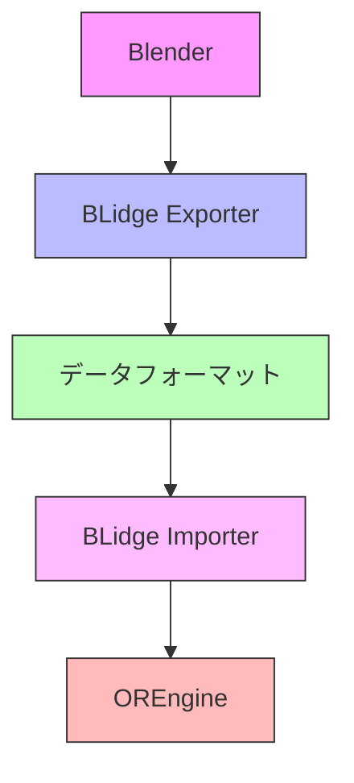
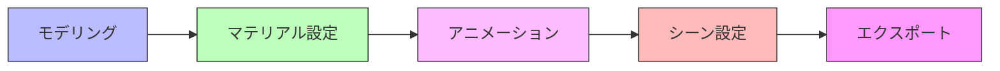

# Blender 連携

## 概要

OREngine は、BLidge（Blender Bridge）システムを通じて Blender との効率的な連携機能を提供します。
この機能により、3D モデル、シーンデータ、アニメーションなどを効率的にエンジンに取り込むことができます。

## BLidge システムの構造



## エクスポート機能

### サポートされるデータ

1. **3D モデル**

   - メッシュデータ
   - UV マッピング
   - ボーン構造
   - モーフターゲット

2. **マテリアル設定**

   - PBR マテリアル
   - テクスチャマッピング
   - シェーダーノード

3. **アニメーション**

   - キーフレームアニメーション
   - ボーンアニメーション
   - モーフアニメーション

4. **カメラ設定**

   - カメラパラメータ
   - アニメーション
   - DOF 設定

5. **ライティング情報**
   - ライトタイプ
   - 色と強度
   - シャドウ設定

## データフォーマット

### シーンデータ構造

```typescript
interface SceneData {
  // オブジェクト階層
  hierarchy: {
    id: string;
    name: string;
    type: string;
    children: Array<any>;
    transform: {
      position: [number, number, number];
      rotation: [number, number, number];
      scale: [number, number, number];
    };
  };

  // コンポーネントデータ
  components: {
    mesh?: {
      geometry: string;
      materials: string[];
    };
    camera?: {
      fov: number;
      near: number;
      far: number;
    };
    light?: {
      type: string;
      color: [number, number, number];
      intensity: number;
    };
  };

  // アニメーションデータ
  animations: {
    [key: string]: {
      duration: number;
      tracks: Array<{
        target: string;
        property: string;
        times: number[];
        values: number[];
      }>;
    };
  };
}
```

## ワークフロー

### 1. Blender でのモデリング



### 2. エクスポートプロセス

```typescript
class BLidgeExporter {
  export() {
    // シーンデータの収集
    const sceneData = this.collectSceneData();

    // メッシュデータのエクスポート
    this.exportMeshes(sceneData.meshes);

    // マテリアルのエクスポート
    this.exportMaterials(sceneData.materials);

    // アニメーションのエクスポート
    this.exportAnimations(sceneData.animations);

    // シーン設定のエクスポート
    this.exportSceneConfig(sceneData.config);
  }
}
```

### 3. エンジンでの読み込み

```typescript
class BLidgeImporter {
  async import(path: string): Promise<Scene> {
    // シーンデータの読み込み
    const data = await this.loadSceneData(path);

    // シーンの構築
    const scene = new Scene();

    // オブジェクトの再構築
    this.reconstructHierarchy(data.hierarchy, scene);

    // コンポーネントの設定
    this.setupComponents(data.components);

    // アニメーションの設定
    this.setupAnimations(data.animations);

    return scene;
  }
}
```

## 最適化とパフォーマンス

### メッシュの最適化

1. **ジオメトリの最適化**

   ```typescript
   class MeshOptimizer {
     optimize(geometry: Geometry) {
       // 頂点の重複除去
       this.deduplicateVertices();

       // インデックスの最適化
       this.optimizeIndices();

       // 法線の再計算
       this.recalculateNormals();
     }
   }
   ```

2. **テクスチャの最適化**
   ```typescript
   class TextureOptimizer {
     optimize(texture: Texture) {
       // サイズの最適化
       this.resizeToOptimal();

       // フォーマットの最適化
       this.convertToOptimalFormat();

       // ミップマップの生成
       this.generateMipmaps();
     }
   }
   ```

### データ圧縮

```typescript
class DataCompressor {
  compress(data: SceneData) {
    // 浮動小数点の精度最適化
    this.optimizeFloatPrecision();

    // 重複データの削除
    this.deduplicateData();

    // データの圧縮
    this.compressData();
  }
}
```

## エラーハンドリング

```typescript
class BLidgeError extends Error {
  constructor(message: string, type: ErrorType) {
    super(message);
    this.type = type;
  }
}

// エラーハンドリングの例
try {
  await blidge.import(path);
} catch (error) {
  if (error instanceof BLidgeError) {
    console.error(`BLidge エラー: ${error.message}`);
  }
}
```

## デバッグとトラブルシューティング

1. **データ検証**

```typescript
class DataValidator {
  validate(data: SceneData) {
    // 階層構造の検証
    this.validateHierarchy(data.hierarchy);

    // コンポーネントの検証
    this.validateComponents(data.components);

    // アニメーションの検証
    this.validateAnimations(data.animations);
  }
}
```

2. **ログ出力**

```typescript
class BLidgeLogger {
  log(level: LogLevel, message: string) {
    console.log(`[BLidge] ${level}: ${message}`);
  }
}
```
